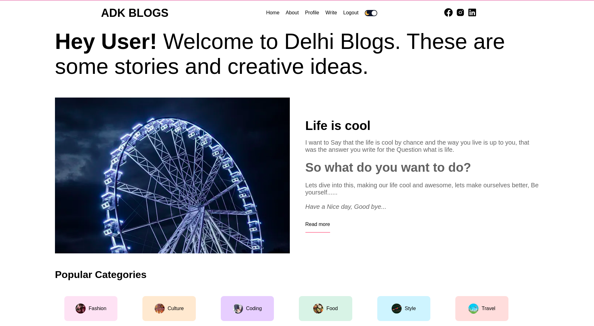
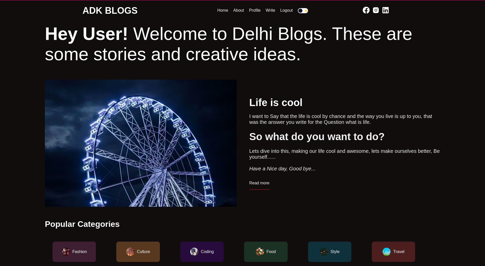
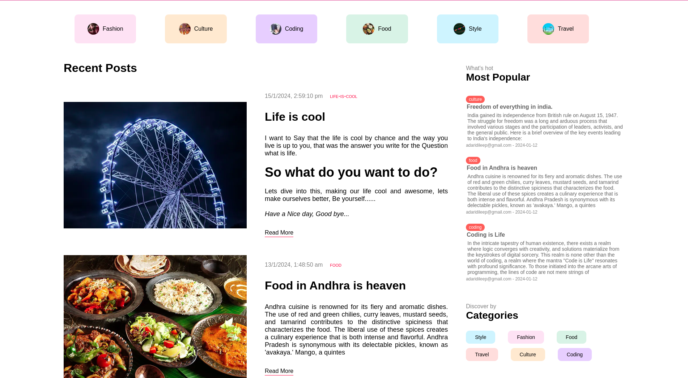
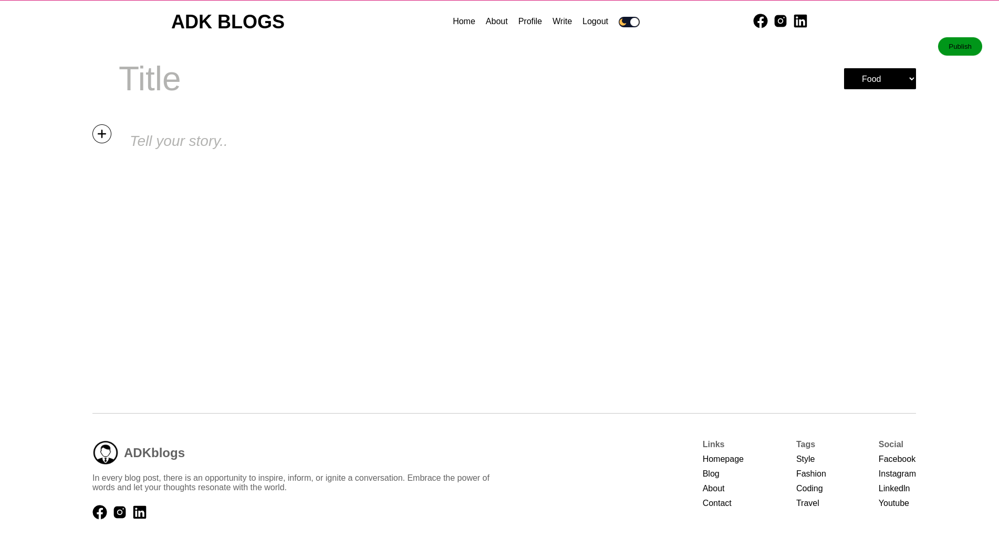
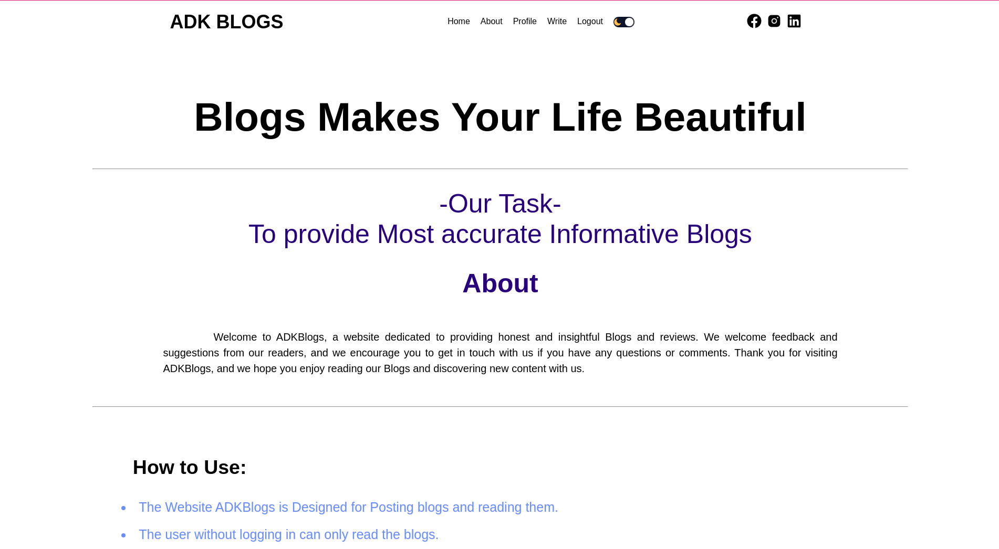
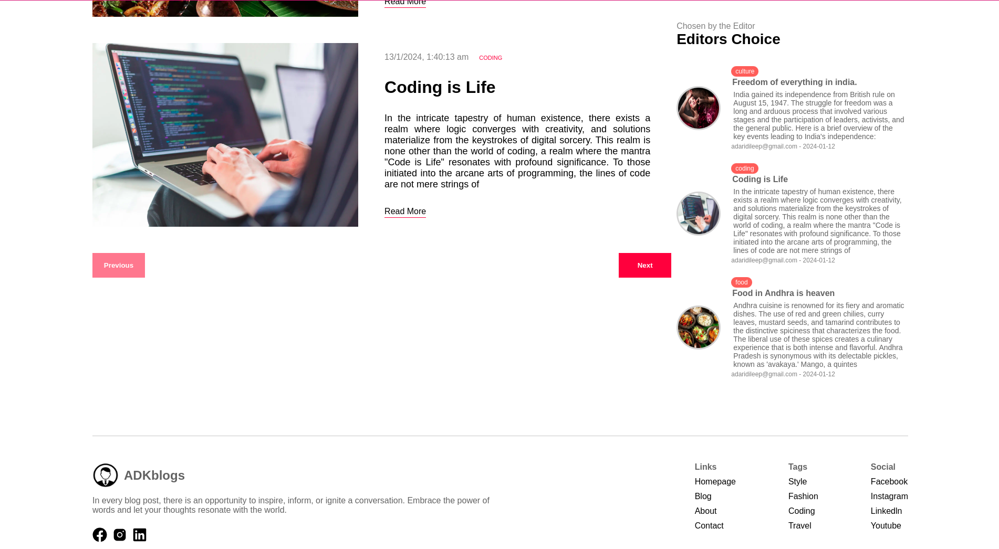

## Getting Started

# Blog_Website_MERN
A Blog website for pposting and reading blogs made with next.js, node.js, mongodb and prisma.    

Problem Statement:    
Create a blog website for reading and writing posts using HTML, CSS, Node.js and MongoDB for data storage.   

# Configuration
Fill the .env.example file with required details and change the name to .env

# Running the project

In the folder, open terminal and run `npm install` - The required modules gets installed   
Then run the project by running `npm run dev` on terminal.    
Connect your wifi to something other than university wifi as Mongodb may not be accessible through College wifi.    
The project will run on `localhost:3000` if your port is 3000, open it in chrome for better experience.    

# About the project
This project is a simple blog system configured by limited categories.   
The project is made using HTML, CSS, Node.js, Next.js,prisma in MongoDB.   
The user can create a new account and can access their dashboard through login with same credentials.  
The user can create a new post and can view all the posts.   
The user can also logout from the dashboard.   
The password have being hashed to assure the security of user account.   
The user can Change theme if he want.   

# Screenshots
## Home Page_LightMode:  
  

## Home Page_DarkMode:   
   

## Recent_Blogs:    
   

## Write:    
   

## About:    
    

## Footer:    
     